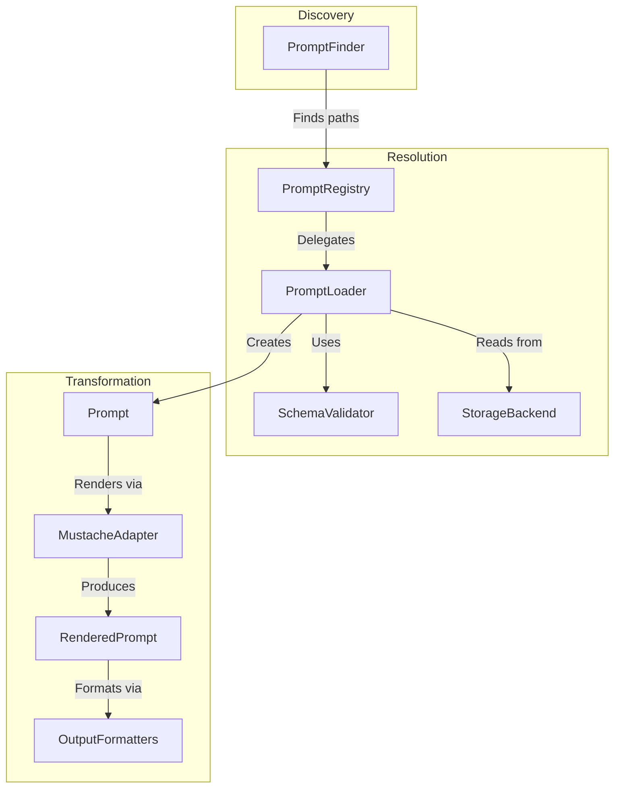
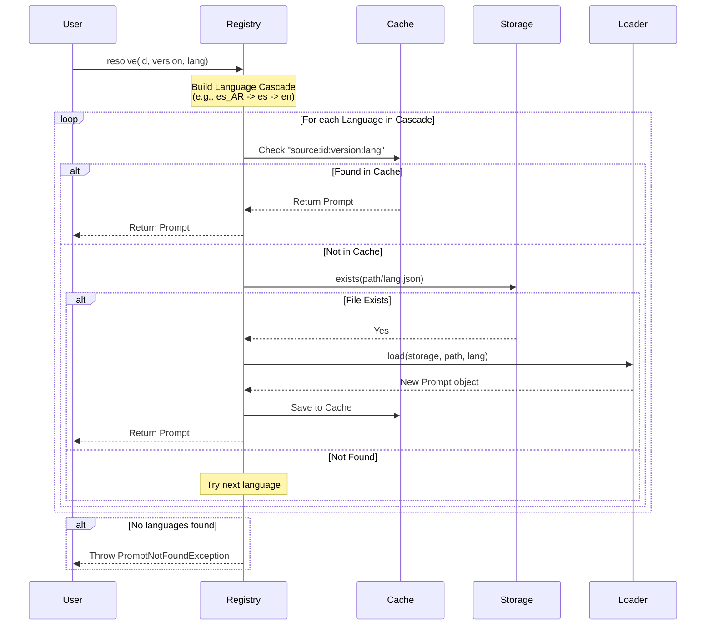
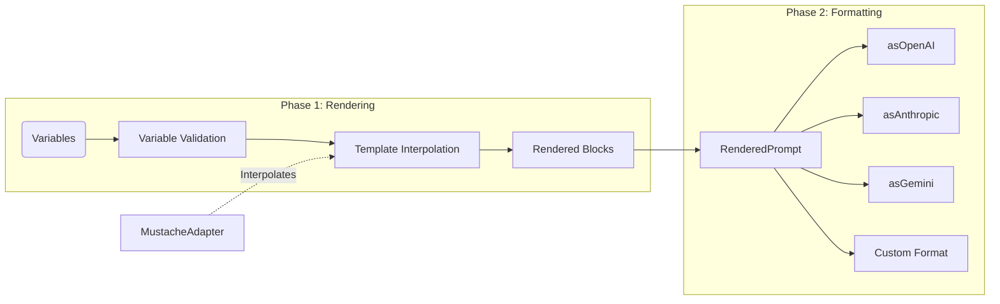

# Library Internals & Logic Flows

This document explains the internal mechanics of `nexus-ai-prompts`. It is intended for collaborators and developers who wish to extend or modify the library's core.

---

## 1. High-Level Architecture

The library is built on three main pillars: **Discovery**, **Resolution**, and **Transformation**.

---

## 2. The Resolve Lifecycle

When a consumer calls `resolve()`, the Registry orchestrates a search across languages and sources.

---

## 3. The Render & Format Lifecycle

Rendering turns a static template into a provider-ready payload in two distinct phases.

---

## 4. Discovery Philosophy

### Static Scan vs. Registry Discovery

`PromptFinder` operates in two modes:

1. **Static Scan (`::scan()`)**: A "stateless" scan that crawls the `vendor/` directory looking for `resources/prompts/`. It uses directory names to guess identifiers and versions. It is incredibly fast because it **never opens a JSON file**.
2. **Registry Discovery**: It queries an instantiated and configured Registry. This allows it to detect collisions between sources and list exactly what the current application has registered.

---

## 5. The Block-Based Redesign

In v1.0.0, the core entity is the **Block**.

- **Independence**: A block doesn't care if it's for Chat or Completion.
- **Multimodality**: Content can be a string (text) or an array (vision/multimodal).
- **Extensibility**: All formatters receive the same list of blocks and decide how to map them. For example:
  - `asOpenAI`: Map `role` + `content`.
  - `asAnthropic`: Extract `system` role to a top-level key, map the rest to `messages`.
  - `asStabilityAI`: Use `content` as text and `weight` as the prompt weight.

---

## 6. Language Cascade Logic

The library follows a strict "Fallback first, Fail last" strategy:

1. **Direct Match**: The exact locale requested (e.g., `es_AR`).
2. **Base Language**: If regional code exists, try the base (e.g., `es`).
3. **Global Fallback**: The `fallbackLanguage` configured in the Registry (default: `en`).

This ensures that even if a translation is missing, the application remains functional.
